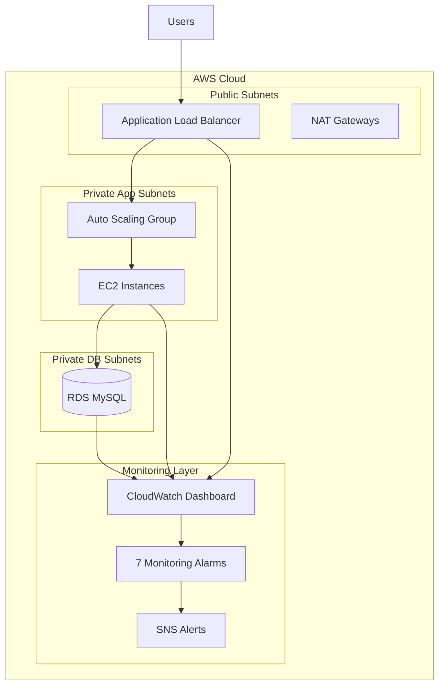
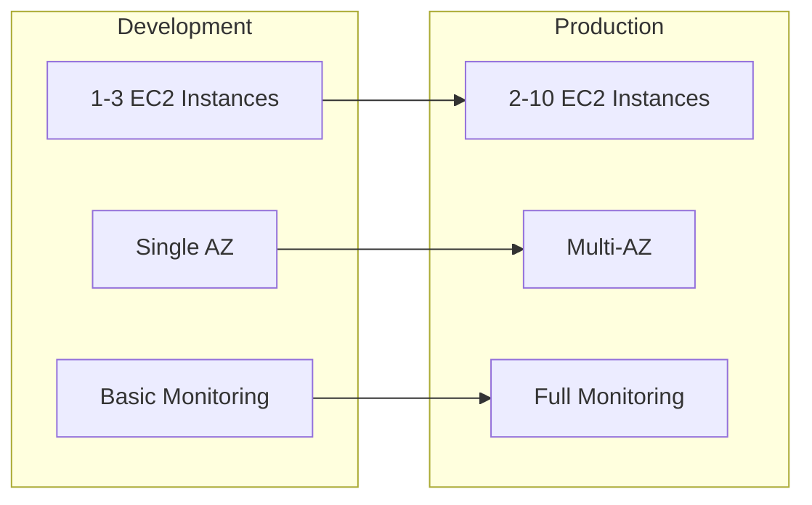

# 🌟 Terraform Web Platform Infrastructure

https://medium.com/@damipetiwo/building-enterprise-grade-aws-infrastructure-with-terraform-a-complete-guide-to-4-tier-54edbbb08b01


[](https://terraform.io)
[](https://aws.amazon.com)
[](https://opensource.org/licenses/MIT)
[](https://github.com)

> **Enterprise-Grade Multi-Environment Web Application Infrastructure**  
> A comprehensive, scalable, and production-ready Terraform solution for deploying modern web applications on AWS with complete observability and monitoring.

---

## 📋 Table of Contents

- [🏗️ Architecture Overview](#️-architecture-overview)
- [🚀 Quick Start Guide](#-quick-start-guide)
- [📁 Project Structure](#-project-structure)
- [⚙️ Configuration Management](#️-configuration-management)
- [📊 Infrastructure Components](#-infrastructure-components)
- [🔍 Monitoring & Observability](#-monitoring--observability)
- [🛡️ Security & Compliance](#️-security--compliance)
- [🌍 Multi-Environment Support](#-multi-environment-support)
- [📈 Scaling & Performance](#-scaling--performance)
- [🔧 Maintenance & Operations](#-maintenance--operations)
- [🤝 Contributing](#-contributing)

---

## 🏗️ Architecture Overview

This Terraform project implements a **4-tier enterprise architecture** designed for scalability, security, and observability:



### 🎯 Architecture Highlights

| **Tier** | **Component** | **Purpose** | **AWS Services** |
|-----------|---------------|-------------|------------------|
| **🌐 Web Tier** | Load Balancing & SSL Termination | High availability traffic distribution | Application Load Balancer, Target Groups |
| **⚡ Application Tier** | Compute & Auto Scaling | Dynamic application hosting with elasticity | Auto Scaling Groups, EC2, Launch Templates |
| **🗄️ Data Tier** | Persistent Storage | Secure, encrypted database services | RDS MySQL, Parameter Groups, Subnet Groups |
| **📊 Monitoring Tier** | Observability & Alerting | Complete infrastructure monitoring | CloudWatch, SNS, Custom Dashboards |

---

## 🚀 Quick Start Guide

### 📋 Prerequisites

Before deploying, ensure you have:

- ✅ **AWS CLI** configured with appropriate IAM permissions
- ✅ **Terraform** >= 1.0 installed and configured
- ✅ **AWS Key Pair** (optional, for EC2 SSH access)
- ✅ **Valid email address** for monitoring alerts

### 🎯 Development Environment Deployment

```bash
# 1. Clone and navigate to project
git clone <repository-url>
cd terraform-web-platform/environments/dev

# 2. Initialize Terraform
terraform init

# 3. Configure your environment
cp terraform.tfvars.example terraform.tfvars
# Edit terraform.tfvars with your settings

# 4. Plan and deploy
terraform plan
terraform apply -auto-approve

# 5. Get deployment outputs
terraform output
```

### 🏭 Production Environment Deployment

```bash
cd environments/prod
terraform init
terraform plan
terraform apply
```

---

## 📁 Project Structure

```
terraform-web-platform/
├── 📂 environments/
│   ├── 🔧 dev/                         # Development environment
│   │   ├── main.tf                     # Environment configuration
│   │   ├── variables.tf                # Environment-specific variables
│   │   ├── terraform.tfvars            # Development values
│   │   └── outputs.tf                  # Environment outputs
│   └── 🏭 prod/                        # Production environment
│       ├── main.tf                     # Production configuration
│       ├── variables.tf                # Production variables
│       ├── terraform.tfvars            # Production values
│       └── outputs.tf                  # Production outputs
├── 📂 modules/
│   ├── 🌐 networking/                  # VPC, Subnets, Security Groups
│   │   ├── main.tf                     # Network infrastructure
│   │   ├── variables.tf                # Network variables
│   │   └── outputs.tf                  # Network outputs
│   ├── ⚡ compute/                     # Load Balancer, Auto Scaling
│   │   ├── main.tf                     # Compute resources
│   │   ├── variables.tf                # Compute variables
│   │   └── outputs.tf                  # Compute outputs
│   ├── 🗄️ database/                   # RDS MySQL Database
│   │   ├── main.tf                     # Database configuration
│   │   ├── variables.tf                # Database variables
│   │   └── outputs.tf                  # Database outputs
│   └── 📊 monitoring/                  # CloudWatch & Alerting
│       ├── main.tf                     # Monitoring setup
│       ├── variables.tf                # Monitoring variables
│       └── outputs.tf                  # Monitoring outputs
├── 📝 README.md                       # This file
└── 
```

---

## ⚙️ Configuration Management

### 🔧 Environment Variables (`terraform.tfvars`)

```hcl
# 🏷️ Environment Configuration
environment = "dev"
aws_region = "us-east-1"
project_name = "webapp"

# 🔐 Security Configuration
db_password = "SecurePassword123!"
key_name = "my-aws-keypair"

# 📧 Monitoring Configuration
notification_email = "admin@yourcompany.com"

# 🖥️ Compute Configuration
instance_type = "t3.micro"
min_size = 1
max_size = 5
desired_capacity = 2

# 🗄️ Database Configuration
db_instance_class = "db.t3.micro"
allocated_storage = 20
multi_az = false
```

### 🌍 Environment-Specific Configurations

| **Setting** | **Development** | **Production** |
|-------------|-----------------|----------------|
| **Region** | `us-east-1` | `us-west-2` |
| **Instance Type** | `t3.micro` | `t3.large` |
| **Min Capacity** | `1` | `2` |
| **Max Capacity** | `3` | `10` |
| **Multi-AZ** | `false` | `true` |
| **DB Instance** | `db.t3.micro` | `db.t3.large` |

---

## 📊 Infrastructure Components

### 🌐 Networking Module (43 Resources)

- **1x VPC** with DNS support and hostnames
- **6x Subnets** (3 public, 3 private) across 3 AZs
- **3x NAT Gateways** for private subnet internet access
- **1x Internet Gateway** for public internet connectivity
- **Route Tables** with appropriate routing rules
- **Security Groups** with least-privilege access

### ⚡ Compute Module

- **Application Load Balancer** with health checks
- **Target Groups** with advanced health checking
- **Launch Templates** with user data scripts
- **Auto Scaling Groups** with scaling policies
- **CloudWatch-based scaling** triggers

### 🗄️ Database Module

- **RDS MySQL 8.0.35** with encryption at rest
- **Multi-AZ deployment** (production)
- **Automated backups** with 7-day retention
- **Parameter Groups** for performance tuning
- **Subnet Groups** for network isolation

### 📊 Monitoring Module

- **CloudWatch Dashboard** with 4 metric sections
- **7x CloudWatch Alarms** for critical metrics
- **SNS Topics** for alert notifications
- **Log Groups** for application logging
- **Custom Metrics** for application insights

---

## 🔍 Monitoring & Observability

### 📈 CloudWatch Dashboard Sections

1. **🖥️ EC2 Metrics**: CPU utilization, network I/O, status checks
2. **🌐 Load Balancer Metrics**: Request count, latency, healthy hosts
3. **🗄️ Database Metrics**: CPU, connections, IOPS, storage
4. **📊 Custom Application Metrics**: Response times, error rates

### 🚨 Monitoring Alarms (7 Critical Alerts)

| **Alarm** | **Metric** | **Threshold** | **Action** |
|-----------|------------|---------------|------------|
| **High CPU Usage** | EC2 CPU > 80% | 5 minutes | Scale Out + Alert |
| **Low CPU Usage** | EC2 CPU < 10% | 10 minutes | Scale In |
| **ALB High Latency** | Response Time > 2s | 2 minutes | Alert Team |
| **Unhealthy Targets** | Healthy Hosts < 1 | 1 minute | Critical Alert |
| **DB High CPU** | RDS CPU > 80% | 5 minutes | DBA Alert |
| **DB High Connections** | Connections > 80% | 3 minutes | Alert |
| **High Error Rate** | HTTP 5xx > 10% | 2 minutes | Urgent Alert |

### 📧 Alert Notifications

All alarms integrate with **SNS topics** for immediate email notifications to operations teams.

---

## 🛡️ Security & Compliance

### 🔐 Security Features

- ✅ **Private Subnets**: EC2 and RDS instances isolated from direct internet access
- ✅ **Security Groups**: Least-privilege access with specific port rules
- ✅ **Encryption**: RDS encryption at rest using AWS KMS
- ✅ **Network ACLs**: Additional network-level security controls
- ✅ **IAM Roles**: Service-specific permissions following AWS best practices
- ✅ **VPC Flow Logs**: Network traffic monitoring and analysis

### 🏛️ Compliance Considerations

- **Data Encryption**: All data encrypted in transit and at rest
- **Access Logging**: Comprehensive audit trails via CloudTrail
- **Network Isolation**: Multi-tier network segmentation
- **Backup Strategy**: Automated daily backups with point-in-time recovery

---

## 🌍 Multi-Environment Support

### 🔄 Environment Isolation Strategy

Each environment maintains:
- **Separate Terraform state files**
- **Independent AWS resource namespaces**
- **Environment-specific variable configurations**
- **Isolated monitoring and alerting**

### 📊 Resource Scaling by Environment



---

## 📈 Scaling & Performance

### ⚡ Auto Scaling Configuration

```hcl
# CPU-based scaling policies
resource "aws_autoscaling_policy" "scale_up" {
  name                   = "scale-up"
  scaling_adjustment     = 1
  adjustment_type        = "ChangeInCapacity"
  cooldown              = 300
  autoscaling_group_name = aws_autoscaling_group.main.name
}
```

### 📊 Performance Metrics

| **Metric** | **Target** | **Monitoring** |
|------------|------------|----------------|
| **Response Time** | < 500ms | CloudWatch |
| **Availability** | > 99.9% | Health Checks |
| **CPU Utilization** | 50-70% | Auto Scaling |
| **Error Rate** | < 1% | ALB Metrics |

---

## 🔧 Maintenance & Operations

### 🚀 Deployment Commands

```bash
# Initialize new environment
terraform init

# Validate configuration
terraform validate

# Plan changes
terraform plan -out=tfplan

# Apply changes
terraform apply tfplan

# View current state
terraform show

# List all resources
terraform state list

# Get specific outputs
terraform output load_balancer_dns
```

### 🧹 Cleanup & Destruction

```bash
# Destroy specific environment
cd environments/dev
terraform destroy

# Force removal of stuck resources
terraform state rm <resource_name>
terraform import <resource_name> <aws_resource_id>
```

### 📋 Maintenance Checklist

- [ ] **Weekly**: Review CloudWatch metrics and alarms
- [ ] **Monthly**: Update Terraform modules and providers
- [ ] **Quarterly**: Security audit and access review
- [ ] **Annually**: Disaster recovery testing

---

## 🔍 Troubleshooting Guide

### ❗ Common Issues & Solutions

| **Issue** | **Cause** | **Solution** |
|-----------|-----------|-------------|
| **Plan fails** | Missing variables | Check `terraform.tfvars` |
| **Apply timeout** | Resource dependencies | Increase timeout values |
| **Access denied** | IAM permissions | Update AWS IAM policies |
| **State lock** | Concurrent operations | `terraform force-unlock <ID>` |

### 🔧 Debug Commands

```bash
# Enable detailed logging
export TF_LOG=DEBUG
terraform apply

# Validate syntax
terraform fmt -check
terraform validate

# Check state health
terraform refresh
terraform state pull
```

---

## 📊 Cost Optimization

### 💰 Cost Analysis

| **Service** | **Monthly Cost (Dev)** | **Monthly Cost (Prod)** |
|-------------|------------------------|--------------------------|
| **EC2 (t3.micro)** | $8.50 | $17.00 (t3.large) |
| **RDS (db.t3.micro)** | $12.60 | $25.20 (Multi-AZ) |
| **ALB** | $16.20 | $16.20 |
| **NAT Gateway** | $32.40 | $97.20 (3 AZs) |
| **CloudWatch** | $3.00 | $10.00 |
| **Total** | **~$72.70** | **~$165.60** |

### 💡 Cost Optimization Tips

- Use **Spot Instances** for development environments
- Implement **scheduled scaling** for predictable workloads
- Enable **RDS storage autoscaling** to optimize database costs
- Use **CloudWatch Logs retention policies** to control log costs

---

## 📚 Additional Resources

### 📖 Documentation

- [**📋 Team Presentation**](./TEAM_PRESENTATION_SLIDES.md) - Complete training slides
- [**📊 Technical Report**](./PRESENTATION_REPORT.md) - Detailed implementation guide  
- [**📑 Quick Reference**](./QUICK_REFERENCE_CARD.md) - Command cheat sheet

### 🔗 External Links

- [Terraform AWS Provider Documentation](https://registry.terraform.io/providers/hashicorp/aws/latest/docs)
- [AWS Well-Architected Framework](https://aws.amazon.com/architecture/well-architected/)
- [Terraform Best Practices](https://www.terraform.io/docs/cloud/guides/recommended-practices/index.html)

---

## 🤝 Contributing

We welcome contributions! Please follow these steps:

1. **🍴 Fork** the repository
2. **🌿 Create** a feature branch (`git checkout -b feature/amazing-feature`)
3. **✅ Test** your changes in the development environment
4. **📝 Commit** your changes (`git commit -m 'Add amazing feature'`)
5. **🚀 Push** to the branch (`git push origin feature/amazing-feature`)
6. **📥 Open** a Pull Request

### 🛡️ Code Standards

- Follow **Terraform formatting** standards (`terraform fmt`)
- Include **comprehensive documentation** for new modules
- Add **appropriate variable descriptions** and validation
- Ensure **backward compatibility** when possible

---

## 📄 License & Support

### 📜 License

This project is licensed under the **MIT License**. See the [LICENSE](./LICENSE) file for details.

### 💬 Support & Contact

- **🐛 Issues**: [GitHub Issues](https://github.com/your-repo/issues)
- **💡 Feature Requests**: [GitHub Discussions](https://github.com/your-repo/discussions)
- **📧 Email**: support@yourcompany.com
- **📞 Team**: DevOps Engineering Team

---

## 🏆 Project Status & Roadmap

### ✅ Current Status: **Production Ready**

- ✅ Complete 4-tier architecture implementation
- ✅ Multi-environment support (dev/prod)
- ✅ Comprehensive monitoring and alerting
- ✅ Security best practices implemented
- ✅ Documentation and training materials
- ✅ Cost optimization features

### 🎯 Future Enhancements

- [ ] **Kubernetes Integration**: EKS cluster module
- [ ] **CI/CD Pipeline**: GitHub Actions integration
- [ ] **SSL/TLS**: Automatic certificate management
- [ ] **Blue-Green Deployments**: Zero-downtime deployment strategy
- [ ] **Multi-Region**: Cross-region disaster recovery
- [ ] **Container Support**: Docker and ECS integration

---

<div align="center">

**🌟 Built with ❤️ by the DevOps Team**

[](https://terraform.io)
[](https://aws.amazon.com)

</div>
